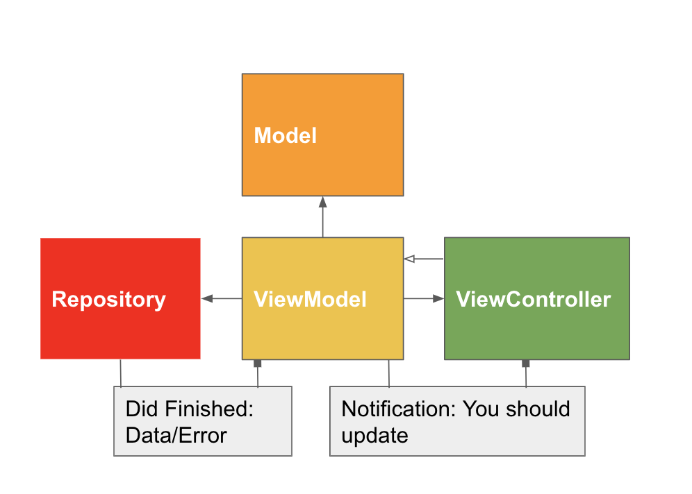
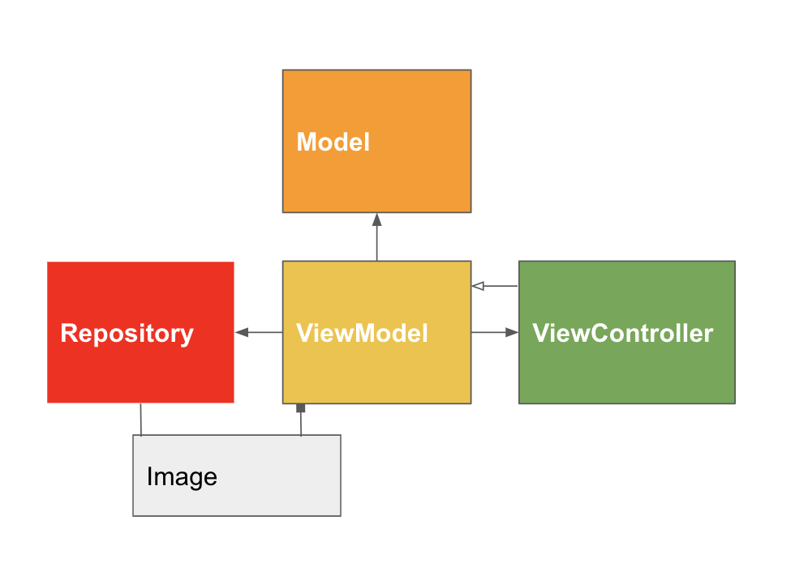
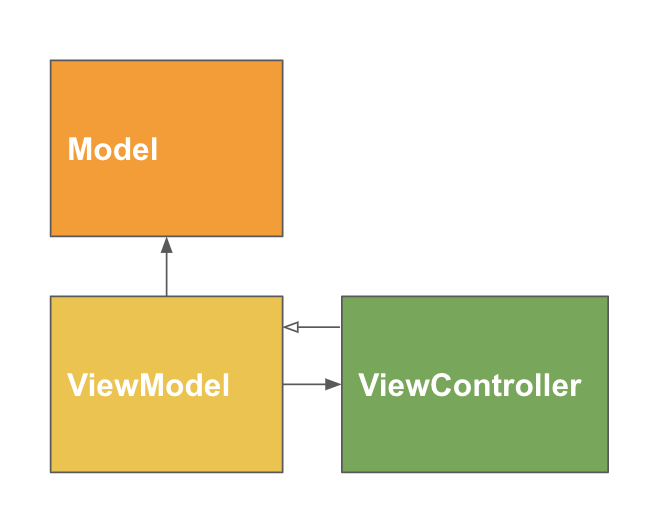

# My dev History 

My dev history is an app containing my resume. It was built with MVVM in mind. Also adding a Repository to manage Service Calls. 

 

### To illustrate the basic interaction between this items: 

 

This means that each **viewModel** is owner of its own **model** and can communicate with the **repository** to  
fetch data from the internet. 
Then the **viewModel** will talk to the **viewController** to update its components. 
The **viewController** then will tell the **viewModel** if an event has been triggered 
So that the **viewModel** can take action 

Since the only **viewModel** that needs to update the model based on a _Service Request_ is the **ResumeViewModel** and all other **viewModels** get their data from the current **viewModel** the other **views** and releations with **viewModels** would look like this:

Since those **viewModels** only need the repository to fetch images through a callback

And in cases that the **viewModel** doesnt need the repository at all, it would look like this:

### This project contains Unit Testing

While designin the tests the whole idea was to test scenarios where the data could fail. Since the  
**ResumeViewController** is our main view and ite **viewModel** is the one asking the **repository** for  

updates on the **model**, we concentrated on decoding and fetching.  

### This project also contains UI Testing 

 

The goal was to test each flow and if the user will be able to get to the end of each flow 
